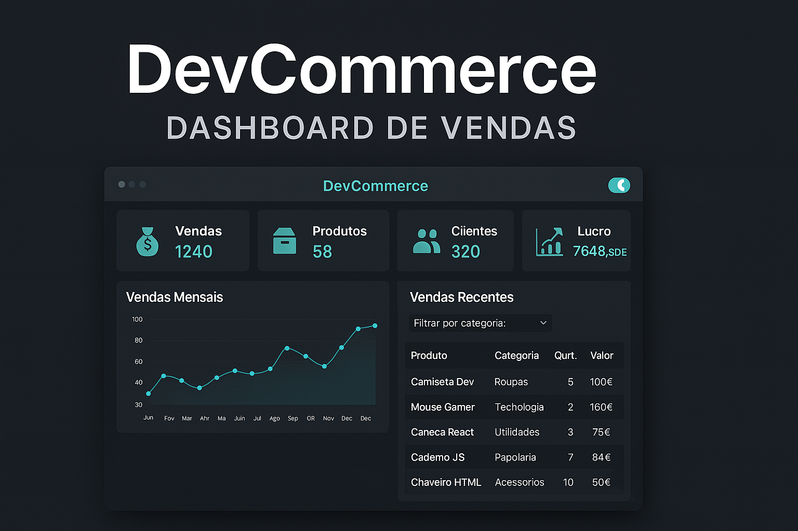

# 📊 DevCommerce | Dashboard de Vendas

Projeto desenvolvido com **HTML, CSS e JavaScript** para simular uma aplicação de dashboard de vendas, com visual moderno, responsivo e interativo.



---

## 🧠 Funcionalidades

- ✅ Exibição de vendas, produtos, clientes e lucro
- ✅ Gráfico de vendas mensais com **Chart.js**
- ✅ Tabela de vendas filtrável por categoria
- ✅ Animações com **ScrollReveal.js**
- ✅ Modo claro/escuro com botão toggle
- ✅ Layout 100% responsivo
- ✅ Tela de login simples

---

## 💻 Tecnologias Utilizadas

- HTML5
- CSS3
- JavaScript
- Chart.js
- ScrollReveal.js

---

## 🖥️ Layout Responsivo

> Visualização do projeto em diferentes dispositivos


---

## 🚀 Como Executar

1. Clone o repositório:
   ```bash
   git clone https://github.com/AndersonGFrota/DevCommerce.git
   ```

2. Abra o arquivo `index.html` no seu navegador.

---

## 🌐 Acesse o Projeto Online

🔗 [Clique aqui para visualizar o DevCommerce](https://devcommercepainel.netlify.app)

---

## 👨‍💻 Autor

**Anderson Frota Gonçalves**

- 💼 [LinkedIn](https://www.linkedin.com/in/andersongfrota/)
- 💻 [GitHub](https://github.com/AndersonGFrota)
- 🌐 [Portfólio](https://andersongoncalves.netlify.app)
- 📧 andersonfrota@outlook.pt

---

> Projeto desenvolvido com fins educacionais e para compor portfólio.
